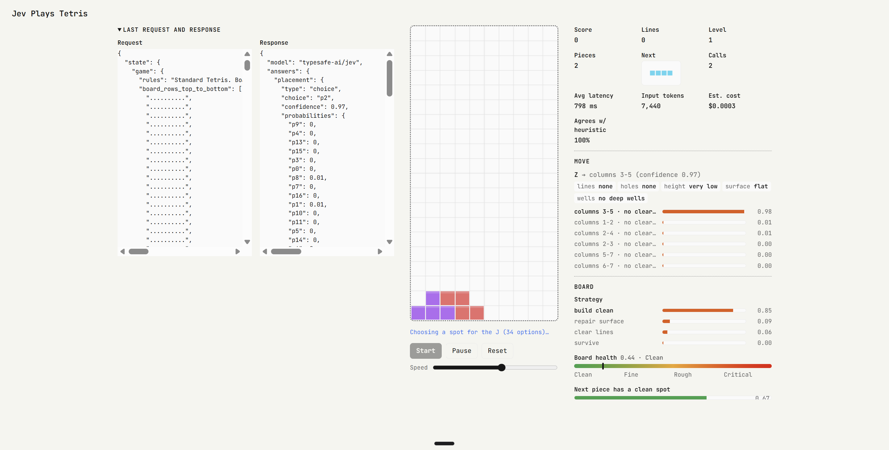

# Jev Plays Tetris



Solo Tetris where every move is chosen by [Jev](https://docs.typesafe.ai), TypeSafe's
System One decision model, called through the
[Vercel AI Gateway](https://vercel.com/docs/ai-gateway) as `typesafe-ai/jev`.
Open the page, press Start, and watch the model play — with its reasoning
(strategy, board health, next-piece fit), the alternatives it considered, and
the raw request/response for every piece.

## Tech stack

- **Runtime:** Node.js 20+ — no dependencies, no build step, no bundler.
- **Server** (`server.mjs`): zero-dependency static file server plus a tiny
  proxy. Browsers can't call the model APIs directly (CORS), so the page posts
  to `POST /api/systemone` and the server forwards it with the key from `.env`.
  The key is never stored, logged, or sent to the browser.
- **Frontend:** vanilla HTML + CSS + JS (`public/`). No framework.
- **Model access:** Vercel AI Gateway, TypeSafe-compatible endpoint
  `https://ai-gateway.vercel.sh/typesafe`, model id `typesafe-ai/jev`.
- **UI:** light-only theme, JetBrains Mono (12/13/16px, 400/600), compact
  Vercel-Geist-inspired sizing. Three columns: request/response inspector on
  the left, game in the middle, stats on the right.
- **Tests:** `node --test` over `test/tetris.test.mjs` (engine + request builder).

## How it works

Each piece follows the same loop (`public/app.js`):

1. **Code enumerates every legal placement** for the falling piece and
   simulates the board after each one — lines cleared, holes created, stack
   height, surface bumpiness, wells (`public/tetris.js`).
2. **Code turns the numbers into words.** Each placement becomes a small object
   with identical fields (`lines_cleared: "two lines"`, `holes_created: "none"`,
   …) so the model compares descriptions instead of doing arithmetic.
3. **One request** carries the board as `state` plus four questions
   (`public/jev.js`): the `placement` Choice that drives the game, plus
   `strategy`, `board_health`, and `next_piece_fits` judgments shown in the UI.
4. **The answer is played.** The chosen placement animates and locks; the panel
   shows the pick with confidence, the alternatives as ghost outlines with
   probabilities, and token/cost stats. A hand-tuned heuristic runs alongside
   so you can see how often the model agrees with it.

Resilience is built around the gateway (`public/jev.js`, `lib/typesafe.mjs`,
`public/app.js`):

- Retries on 429/502/503/504 with exponential backoff, jitter, and
  `Retry-After` support — on both the proxy and the page.
- A short pace delay between model calls so a fast game never hammers the gateway.
- If the gateway stays down after all retries, the heuristic plays that one
  piece with a warning banner and the model is tried again next piece — the
  game never stops on a 503.

## How Jev works

Jev is not a text generator. You hand it a piece of program state plus typed
questions, and it returns typed answers with calibrated probabilities —
no parsing, no hallucinated tool calls. Three question types:

| Type | Returns | Used here as |
| --- | --- | --- |
| `choice` | winning option + per-option probabilities | which placement, which strategy |
| `score` | position on an ordered rubric | board health (Clean → Critical) |
| `noul` | probability of true | next piece has a clean spot |

All four questions are evaluated in parallel against the same state in a single
request (speculative fan-out). Billing is per input token only
(~$0.042/MTok); output tokens are free. The `model` field in each response
reports the versioned id that answered.

## Installation

Requires Node.js 20 or newer. There are no dependencies to install.

```sh
# 1. Get a Vercel AI Gateway key (AI Gateway → API keys)
# 2. Put it in .env (already gitignored):
AI_GATEWAY_API_KEY=vck_...
TYPESAFE_API_BASE=https://ai-gateway.vercel.sh/typesafe
JEV_MODEL=typesafe-ai/jev
PORT=3000

npm start
# open http://localhost:3000/solo.html and press Start
```

`/` redirects to `solo.html`. No key is entered in the page — the server uses
its `.env` fallback key.

| Variable | Meaning | Default |
| --- | --- | --- |
| `AI_GATEWAY_API_KEY` | Gateway key used when the page sends none | — |
| `TYPESAFE_API_KEY` | Direct TypeSafe key (alternative to the gateway) | — |
| `TYPESAFE_API_BASE` | Model API base URL | gateway URL if a gateway key is set, else `https://api.typesafe.ai` |
| `JEV_MODEL` | Model id sent per move | `typesafe-ai/jev` on gateway, `jev-latest` direct |
| `PORT` | Port to listen on | `3000` |

```sh
npm test   # engine + request-builder suite
```

## Files

```
server.mjs            static server + /api/systemone, /api/models, /api/config
lib/typesafe.mjs      proxy logic, .env loading, model-id normalization, retries
api/*.js              same proxy as Vercel serverless functions
public/solo.html      the game page (three-column layout)
public/index.html     redirect to solo.html
public/app.js         game loop, rendering, stats, pacing, fallback play
public/jev.js         request builder, gateway call with retry, answer mapping
public/tetris.js      pure engine: pieces, placements, outcome descriptions
public/style.css      light compact theme (JetBrains Mono)
test/tetris.test.mjs  node --test suite
```
